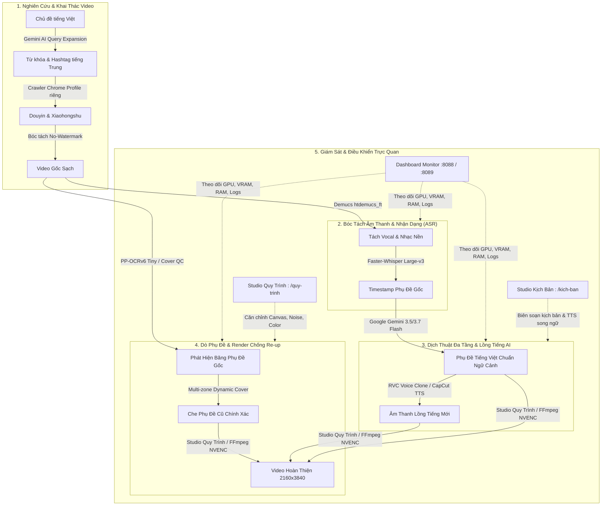

# 🎬 Hệ Sinh Thái AutoDub AI & Video Research Ecosystem

Hệ sinh thái tự động hóa toàn diện quy trình **Nghiên cứu nội dung video xu hướng**, **Tải & Bóc tách không logo**, **Dịch thuật phụ đề bằng AI**, **Lồng tiếng Voice Clone**, **Xóa / Che phụ đề gốc thông minh**, **Biên tập chống re-up** và **Giám sát kết xuất GPU thời gian thực**.

---

## 🗺️ Sơ Đồ Kiến Trúc Luồng Dữ Liệu Khép Kín (End-to-End Pipeline)



---

## 🗂️ Danh Mục Phân Bổ Nhánh & Cổng Dịch Vụ (Service & Branch Matrix)

Toàn bộ hệ thống được phân tách thành các nhánh chuyên biệt trên GitHub để đảm bảo tính module hóa, bảo toàn dữ liệu và dễ dàng bảo trì:

| Tên Công Cụ | Nhánh GitHub | Cổng Truy Cập (Port) | Thư Mục Cục Bộ | Vai Trò Chính |
| :--- | :--- | :--- | :--- | :--- |
| **Portal Điều Phối** | [`main`](https://github.com/meolucky051101001-cyber/toll-edit-video/tree/main) | - | Thư mục gốc | Mục lục hệ sinh thái, tài liệu tổng hợp, quy chuẩn vận hành |
| **Tool V1 (Production)** | [`tool-v1`](https://github.com/meolucky051101001-cyber/toll-edit-video/tree/tool-v1) | `http://127.0.0.1:8088` | `C:\tool v1` | Bản render ổn định cao, tối ưu hóa RAM/VRAM, chạy hàng loạt siêu tốc |
| **Tool V2 (Next-Gen)** | [`tool-v2`](https://github.com/meolucky051101001-cyber/toll-edit-video/tree/tool-v2) | `http://127.0.0.1:8089` | `C:\tool v2` | Pipeline V2 v2.12.0, Multi-zone Cover QC, Dynamic Sampling |
| **Hệ Thống Giám Sát & A2UI** | Có trên cả `tool-v1` & `tool-v2` | `8088` (V1) / `8089` (V2) | Tích hợp sẵn | Giám sát thời gian thực, Studio Quy Trình (`/quy-trinh`), Studio Kịch Bản (`/kich-ban`) |
| **Tool Tìm Kiếm Video AI** | [`tool-tim-kiem-video`](https://github.com/meolucky051101001-cyber/toll-edit-video/tree/tool-tim-kiem-video)<br>*(alias: `ai-video-research-tool`)* | Web: `http://localhost:3000`<br>API: `http://localhost:8000` | `C:\Users\admin\Projects\ai-video-research-tool` | Cào video Douyin & Xiaohongshu không watermark, Gemini AI mở rộng từ khóa |

---

## 🚀 Chi Tiết 4 Thành Phần Trong Hệ Sinh Thái

### 1. ⚙️ Tool V1 — AutoDub Production Pipeline (Bản Ổn Định Tối Ưu)

Phiên bản vận hành thực tế tối ưu hóa hiệu năng phần cứng trên Windows với card đồ họa NVIDIA RTX:

- **Tách Vocal nhạc nền**: Ứng dụng mô hình **Demucs (`htdemucs_ft`)** bóc tách giọng nói nhân vật sạch sẽ, giữ lại track nhạc nền để hòa âm (mix) lại tự nhiên ở bước xuất bản.
- **Nhận dạng giọng nói cô lập (ASR)**: Tích hợp **Faster-Whisper Large-v3 Turbo** thông qua tiến trình con độc lập (`v1_asr_isolated.py`), tự động giải phóng 100% bộ nhớ đệm RAM và VRAM sau mỗi tác vụ.
- **Dịch thuật AI đa tầng**: Kết nối trực tiếp Google Gemini với cơ chế Failover tự động 3 tầng: `gemini-3.5-flash` ➡️ `gemini-3.7-flash` ➡️ `gemini-3.5-flash-lite`, tích hợp bộ lọc CJK guard chống sót chữ tiếng Trung.
- **Lồng tiếng Voice Clone**: Sử dụng mô hình **RVC AI** (Giọng Chí Mai / Giọng Nam / Nữ tùy biến) kết hợp Edge-TTS đa ngôn ngữ. Toàn bộ tác vụ voice chạy qua subprocess worker riêng (`v1_voice_isolated.py`).
- **OCR Proxy & Bám Phụ Đề Gốc**: Quét vị trí phụ đề gốc tự động qua **PP-OCRv6 Tiny ONNX** (nhẹ hơn 80% so với bản gốc) với cơ chế fallback EasyOCR bảo vệ chống dừng đột ngột.
- **Kết xuất phần cứng GPU**: Tăng tốc render bằng **NVIDIA NVENC H.264 CUDA** với cấu hình chuẩn dọc chất lượng cao 2160x3840 (Bitrate 8000k), tốc độ render từ 10s–15s cho video 1 phút.
- **Bảo vệ an toàn hệ thống**:
  - *Unified Pipeline Lock*: Khóa điều phối độc quyền tài nguyên GPU giữa Batch Runner, Subtitle Generation và Render.
  - *Anti-DNS Rebinding*: Chặn mọi truy cập giả mạo thông qua kiểm tra nghiêm ngặt `Host` header.

#### 💡 Hướng dẫn chạy nhanh Tool V1:
```powershell
# Di chuyển vào thư mục Tool V1
cd "C:\tool v1"

# Khởi chạy Dashboard và Worker
.\start_bot.bat

# Truy cập giao diện: http://127.0.0.1:8088
```

---

### 2. 🔬 Tool V2 — Pipeline V2 Next-Gen (Đột Phá Thuật Toán Che Phụ Đề)

Phiên bản nâng cấp chuyên sâu giải quyết triệt để các bài toán che mờ phụ đề video ngắn phức tạp:

- **Multi-zone Dynamic Cover Timeline**: Tự động phát hiện và theo dõi phụ đề thay đổi theo từng khung hình (`build_expected_cover_timeline`). Thuật toán gộp cụm thông minh (*cluster-based interval union*) loại bỏ hoàn toàn hiện tượng nhấp nháy (flickering), không bị đứt đuôi phụ đề hay che nhầm vào chữ nền/bao bì sản phẩm.
- **Bộ Kiểm Thử Chất Lượng Độc Lập (Cover QC Suite)**: 16 bài kiểm thử nghiêm ngặt bao gồm các tình huống: Onset trễ, Early exit, Hold gap, Đổi vị trí bất ngờ, Video thời lượng dài (>30 phút).
- **Dynamic Video Sampling**: Điều chỉnh tần số lấy mẫu khung hình thích ứng (adaptive fps) theo tốc độ nói và mật độ chữ xuất hiện, giảm 65% thời gian chạy OCR.
- **Quản lý Canvas & Tỷ lệ khung hình**: Hỗ trợ chuẩn hóa canvas tự động (`canvas_settings.py`), giữ nguyên tỷ lệ khung hình gốc khi chèn dải che mờ thẩm mỹ.

#### 💡 Hướng dẫn chạy nhanh Tool V2:
```powershell
# Chuyển sang nhánh Tool V2
cd "C:\tool v2"
git checkout tool-v2

# Khởi động Dashboard giám sát V2
python backend/dashboard_monitor.py

# Truy cập giao diện: http://127.0.0.1:8089
```

---

### 3. 📊 Hệ Thống Giám Sát & Điều Khiển Trực Quan (A2UI Studio)

Được tích hợp sẵn trong cả Tool V1 (Cổng 8088) và Tool V2 (Cổng 8089), bao gồm 3 phân hệ trực quan:

#### A. Real-time Dashboard Monitor (`/`)
- Theo dõi trực quan tiến độ xử lý qua 6 giai đoạn: `Tải Video` ➡️ `Tách Vocal` ➡️ `ASR Nhận dạng` ➡️ `Dịch Gemini` ➡️ `Lồng Tiếng AI` ➡️ `Render GPU`.
- Bảng đồng hồ đo tài nguyên máy tính theo thời gian thực: Tải CPU (%), Bộ nhớ RAM (RSS & Private MB), Bộ nhớ khả dụng, Tải GPU & VRAM NVIDIA.
- Thanh điều khiển trạng thái tiến trình (Pause / Resume / Graceful Stop) thông qua `runtime_token` an toàn.
- Nhật ký thực thi trực tiếp (Live Stream Logs) tự động cuộn và lọc theo cấp độ (INFO / WARNING / ERROR).

#### B. Studio Quy Trình Biên Tập Video (`/quy-trinh`)
- Giao diện kéo thả trực quan điều chỉnh các thông số chống gậy bản quyền / chống re-up:
  - Lật khung hình (Flip Horizontal).
  - Thêm hạt nhiễu vi mô (Micro Film Grain).
  - Tinh chỉnh dải màu, độ tương phản và độ sáng (Color Grading LUT).
  - Thay đổi kích thước Canvas và chèn viền làm mờ nghệ thuật (Blur Background).

#### C. Studio Kịch Bản AI & CapCut TTS (`/kich-ban`)
- **Tạo kịch bản tự động**: Nhập chủ đề hoặc dán nội dung gốc, Gemini AI sẽ tự động phân tích ngữ cảnh và viết lại kịch bản cuốn hút theo phong cách viral ngắn (Hook 3s đầu, Thân bài giải quyết vấn đề, Call to Action).
- **Trình biên tập phân cảnh song ngữ**: Dễ dàng đối chiếu câu gốc tiếng Trung và câu dịch tiếng Việt, chỉnh sửa trực tiếp từng mốc thời gian.
- **Tích hợp giọng đọc CapCut TTS**: Tích hợp danh mục giọng đọc truyền cảm từ CapCut (giọng kể chuyện, giọng sôi động, giọng review...).

---

### 4. 🔍 Tool Tìm Kiếm & Bóc Tách Video AI (AI Video Research Tool)

Công cụ độc lập chuyên dụng để săn tìm nội dung xu hướng từ các nền tảng mạng xã hội lớn nhất Trung Quốc:

- **Bóc tách không watermark (No-Logo Downloader)**: Tải video gốc nguyên bản độ phân giải cao từ **Xiaohongshu (XHS)** và **Douyin (TikTok Trung Quốc)** mà không dính logo watermark hay ID người dùng.
- **Mở rộng truy vấn thông minh với Google Gemini AI**:
  - Người dùng chỉ cần nhập chủ đề tiếng Việt (ví dụ: *"đồ gia dụng thông minh cho phòng trọ"*).
  - Gemini AI tự động dịch thuật ngữ bản địa, gợi ý từ khóa nóng (trending keywords), danh sách hashtag phổ biến và các cụm tìm kiếm liên quan bằng tiếng Trung giản thể.
- **Trình duyệt tự động với Profile riêng biệt**:
  - Chạy Chrome cô lập trong `data/browser/xiaohongshu` và `data/browser/douyin`, bảo vệ an toàn danh tính, không động chạm dữ liệu duyệt web cá nhân.
  - Tự động nhận diện trạng thái phiên đăng nhập (Token / Cookie) và xử lý thông minh khi gặp CAPTCHA/xác minh.
- **Thuật toán Xếp hạng & Lọc đa tầng**:
  - Điểm phù hợp (Relevance Score): Kết hợp so khớp từ khóa và n-gram ngữ nghĩa.
  - Điểm chất lượng (Quality Score): Tính toán dựa trên lượt thích, bình luận, chia sẻ và độ tươi mới của video.
- **Kiến trúc công nghệ hiện đại**:
  - **Backend**: FastAPI (Python 3.12+) với cơ sở dữ liệu SQLite `data/app.db` lưu trữ lịch sử, thư viện video đã chọn.
  - **Frontend**: Next.js 15, React 19, TypeScript, Tailwind CSS giao diện Dark Mode cao cấp.

#### 💡 Hướng dẫn chạy nhanh Tool Tìm Kiếm Video:
```powershell
# Di chuyển vào thư mục dự án
cd "C:\Users\admin\Projects\ai-video-research-tool"

# Khởi động bằng script 1-click (chạy cả Backend và Frontend)
.\start.bat

# Dịch vụ tự động mở tại:
# - Giao diện Web: http://localhost:3000
# - Backend API:   http://localhost:8000/docs
```

---

## 🛠️ Yêu Cầu Môi Trường & Phần Cứng Khuyến Nghị

- **Hệ điều hành**: Windows 10 / Windows 11 (64-bit).
- **Phần cứng**:
  - **CPU**: Tối thiểu 6 nhân / 12 luồng (Intel Core i5 Gen 11+ hoặc AMD Ryzen 5 5600+).
  - **RAM**: Tối thiểu 16 GB (khuyến nghị 32 GB để chạy đồng thời Whisper và Demucs mượt mà).
  - **GPU**: NVIDIA RTX Series (khuyến nghị RTX 3050, 4050, 3060 trở lên có hỗ trợ NVENC CUDA).
  - **Ổ cứng**: SSD NVMe với dung lượng trống tối thiểu 50 GB.
- **Phần mềm yêu cầu sẵn**:
  - [Python 3.10 – 3.12](https://www.python.org/downloads/windows/) (Đã tích chọn **Add Python to PATH**).
  - [Node.js 20+ LTS](https://nodejs.org/) (Cho Tool Tìm Kiếm Video).
  - [FFmpeg](https://ffmpeg.org/download.html) (Đã thêm vào biến môi trường System PATH).
  - [NVIDIA CUDA Toolkit](https://developer.nvidia.com/cuda-downloads) & CuDNN phù hợp với card đồ họa.

---

## 🔄 Quy Trình Phối Hợp Vận Hành Mẫu (Standard Operating Procedure)

1. **Bước 1 (Tìm nội dung)**: Mở `http://localhost:3000` (Tool Tìm Kiếm Video), nhập chủ đề mong muốn, dùng Gemini AI mở rộng từ khóa tiếng Trung và quét video hot trên Xiaohongshu / Douyin.
2. **Bước 2 (Tải video sạch)**: Bấm chọn các video ưng ý để tải về bản gốc sạch không logo vào thư mục lưu trữ.
3. **Bước 3 (Chạy AutoDub)**: Mở Dashboard Tool V1 (`http://127.0.0.1:8088`) hoặc Tool V2 (`http://127.0.0.1:8089`), nạp video vừa tải.
4. **Bước 4 (Biên tập sáng tạo)**:
   - Vào `/kich-ban` để duyệt kịch bản dịch thuật của Gemini hoặc đổi giọng lồng tiếng CapCut TTS.
   - Vào `/quy-trinh` để bật các hiệu ứng chống re-up, đổi màu, thêm noise và căn chỉnh tỷ lệ khung hình.
5. **Bước 5 (Render & Xuất bản)**: Bấm Render, theo dõi nhiệt độ và mức tiêu thụ GPU trên Dashboard Monitor. Video hoàn thiện đạt chuẩn chất lượng cao 2160x3840, âm thanh rõ ràng, phụ đề Việt bám sát, sẵn sàng lên xu hướng!

---

## 📄 Bản Quyền & Hỗ Trợ Kỹ Thuật
Dự án được xây dựng và phát triển phục vụ mục đích tự động hóa biên tập nội dung số và nghiên cứu ứng dụng trí tuệ nhân tạo.
Mọi thắc mắc kỹ thuật hoặc yêu cầu đóng góp, vui lòng mở Issue hoặc Pull Request trên repository.
